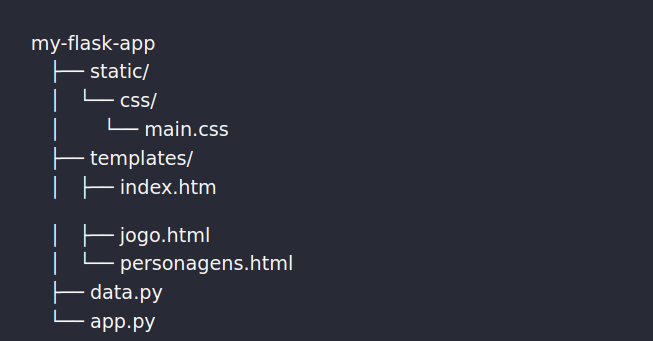

###### **09/10/2023**

ESTUDO BACKEND FLASK DA ESCOLA IFOOD/KORU

***O que foi feito ?***

* Certifique-se de que o Python esteja instalado corretamente em seu sistema e esteja funcionando sem problemas.

```
python --version
```

* Verifique se o `pip` (gerenciador de pacotes Python) está funcionando corretamente.

`pip --version`

* Se o `pip` estiver desatualizado, atualize-o usando o seguinte comando:

```
pip install --upgrade pip
```

* **Instalar o Flask em um Ambiente Virtual** : Às vezes, problemas de instalação podem ocorrer devido a conflitos entre pacotes ou configurações do sistema. É uma boa prática criar um ambiente virtual para seus projetos Python. Crie um ambiente virtual e tente instalar o Flask dentro dele:

```
python -m venv venv
venv\Scripts\activate
pip install Flask
```

* Realizado a verificação se o framework Flask está na lista do python

```
pip list
```

* Ativar o Ambiente Virtual:

```
source venv/bin/activate

```

* Criado o controle de versão apenas dos arquivos de código-fonte e das dependências do seu projeto

```
pip freeze > requirements.txt

```

--------------------------------       ESTRUTURA DO PROJETO  ----------------------------------



* `static/`: Esta pasta é usada para armazenar arquivos estáticos, como folhas de estilo CSS, JavaScript e imagens. No caso,  já tem uma subpasta `css/` para armazenar seu arquivo `main.css`.		,
* `templates/`: Aqui é onde  deve colocar seus modelos HTML e pode renderizar esses modelos nas rotas apropriadas em seu aplicativo Flask.
* `data.py` e `app.py`: Esses arquivos define suas classes e lógica relacionada aos dados do seu aplicativo, como modelos de dados e funções de manipulação de dados.

---

**10/10/2023**

ROTAS:

As rotas foram definidas no arquivo app.py por convenção.

1. `/jogo`: Rota para a página de jogo, onde os usuários podem jogar e mover o caminhão.
2. `/move_truck`: Rota para mover o caminhão durante o jogo e atualizar a pontuação.
3. `/reset_game`: Rota para redefinir o jogo, restaurando a posição do caminhão e a pontuação.
4. `/index`: Rota para a página inicial que contém um botão "Jogar Agora".
5. `/personagens`: Rota para listar personagens (você precisa fornecer a lógica e o modelo para esta página).

Para rodar o projeto vá até a raiz do projeto e execute:

```
python app.py
```

O projeto vai executar no server:

http://127.0.0.1:5000/

Incluindo o .gitignore para que o git não suba arquivos indesejados.

Exemplo: cache e venv
